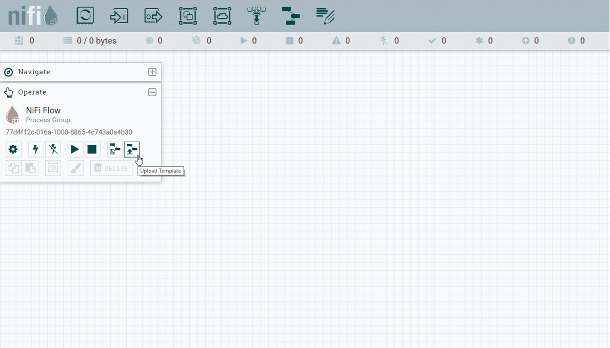

# nifi-demo
Nifi docker-compose file with demo templates

## How to start

1. run docker-compose up
1. go to http://localhost:9090/nifi

## How to load templates

1. upload template via "Operate" menu
1. load template in flow




## Run simple\_database\_service

1. double-click process group
1. double click "QueryDatabaseTable" processor
1. in properties tab: click arrow -> next to "DBCPConnectionPool" in row "Database Connection Pooling Service"
1. enable the AvroReader Service by clicking the lightning icon on the right
1. enable the DBCPConnectionPool Service by clicking the lightning icon on the right
1. right-click both processors and select "Start"


## run simple\_download\_service

1. double-click process group
1. double click "HandleHttpRequest"
1. in properties tab:  click arrow -> next to "StandardHttpConectMap" in row "HTTP Context Map"
1. enable the "StandardHttpContextMap" Service by clicking the lightning icon on the right
1. start all processors
1. open curl/Postman/Insomnia and send the following json inside the body (other possible values: "second.jpg", "third.jpg") to localhost:15000/getFile:

```json
{
	"filename": "first.jpg"
}

```

*Note*: try to send another value such as "fourth.jpg" or "/etc/passwd" to see what happens

## run full\_download\_service

similar to other services

*Note*: try to send another value such as "fourth.jpg" or "/etc/passwd" to see what happens
